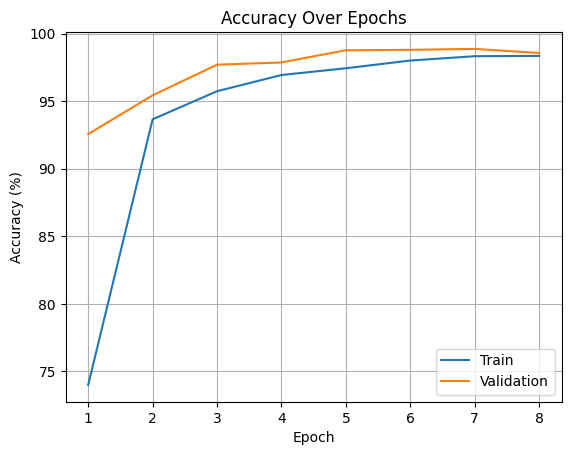
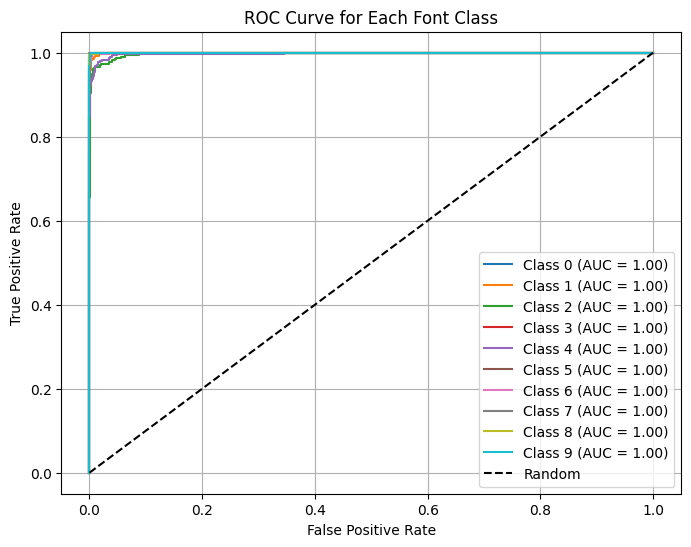

# Font Classification
The task for this is to create a Font Classifier. The classifier should take a single image as input and return the name (or label) of the font used in the image from a predefined list of 10 fonts.
Fonts to Classify:
1.	Aguafina Script
2.	Alex Brush
3.	Allura
4.	Alsscrp
5.	Canterbury
6.	Great Vibes
7.	Holligate Signature
8.	I Love Glitter
9.	James Fajardo
10.	Open Sans

## How to Setup and Run the project
Before getting started make sure you have the required packages to run from requirements.txt

### If you want to learn about whole development process?
Please run the font_classification.ipynb file cell by cell and the text will explain the data collection and preparation techniques, model development and evaluation metrics. The .ipynb must rest in the same directory as the supplied data and font folder in this repo as it will make use of them to generate 20000 images which will be stored in data_train/ and test/ folders.
  
To create new model weights uncomment code cell 13 under Results.

### If you want to test the model against a held out dataset?
Run the first code cell of the .ipynb file and then go the 14th code block which is under the title "Model Evaluation on Test samples" to line 45 and replace "unseen_data_path = 'test'" with "unseen_data_path = 'path to the held out dataset'", then run the cell. Make sure your data is structured the same as that of the data/ folder. This will generate the Accuracy, precision, recall, F1 score, ROC and AUC score for the held out data for the model.

### If you want to just run a font image to find its font?
Make use of the fontPrediction.py by passing the image path as an argument.
Usage: `python fontPrediction.py image\path`
This file need to be in the same folder as the "final_font_class_10_model.pth" (provided in the repo) which are the model weights for the resnet. It is slow as it only takes a single image at a time. This file is not to be used in any other application its purpose is to just show the workings of the model.

## How in the model structured
The model is a pretrained resnet, with a extra fully connected layer to accomadate dropout. We load the model weights "final_font_class_10_model.pth" the input needs to be 128 X 128 tensor normalized mean=[0.485, 0.456, 0.406] and std=[0.229, 0.224, 0.225] To maximize accuracy of the model the input needs to be greyscale and needs to be fed into the model in patches of 128 X 128 at a stride of 28 pixels output is the majority prediction of all the image patches as demostrated in the <b>fontPrediction.py</b>

Please read fontPrediction.py to get a better understanding of the model. 

## Evaluation Metrics
To evaluate the performace we make use of precision score, recall score, f1 score for each class. Precision measures the proportion of correctly classified font instances among all instances classified
as that font. Recall measures the proportion of correctly classified font instances out of the total instances of that font class. The F1-score is the harmonic mean of precision and recall, providing a 
balanced evaluation.

We also make use of  Receiver Operating Characteristic (ROC) curve and the Area Under the Curve (AUC) score can be useful for evaluating the performance of a classifier for each font class against all
other classes. A high AUC score indicates that the classifier can effectively distinguish between the target font class and the rest.

## Training and Validation
For the application of studying patterns in image data for classification of font Convolutional Neural Networks come to mind. From the study of Tensmeyer et al 2017 [1] and Mohammadian et al 2023 [2] in font
classification Res-Net architecture seems like the most viable options. ResNet allows for the training of very deep neural networks, even exceeding 100 layers. Deeper networks have the potential to capture more
complex patterns and hierarchical features in images, leading to better performance in image classification tasks. The Residual connections, which are introduced in ResNet, help to mitigate the vanishing gradient
problem. By allowing the gradient to bypass some layers, the network can propagate information more effectively during training, enabling the training of deeper networks without suffering from degradation in
performance. It also consists of pooling layers reduce the spatial dimensions (width and height) of the input feature maps while preserving important features. This reduction in dimensionality reduces the
computational cost of subsequent layers and helps in controlling overfitting by reducing the model's parameter count.

For this application we data augmentation to prevent overfitting by random rotation, random horizontal flips and Vertical flips. Also in the fully connected layer we add an extra layer dropout so it can generalize
better even if all features are not there.

We make use of a pretrained resnet for the task as studies show evidence of better performance by using a pretrained model Sharif et al (2014)[3]

The data is augmented we do a random split on the data into 15% test, 15% validation and 70% trainning set, we make use of SGD optimizer as it is computationally efficient and scales well to
large datasets commonly encountered in image classification tasks and Cross entropy loss as it work we will classification problems.

We keep track of training accuracy, validation accuracy, training loss and validation loss at every epoch.
<table>
  <tr>
    <th>Epoch</th>
    <th>Train Loss</th>
    <th>Train Acc</th>
    <th>Val Loss</th>
    <th>Val Acc</th>
  </tr>
  <tr>
    <td>[1/8]</td>
    <td>0.7727</td>
    <td>74.00%</td>
    <td>0.1958</td>
    <td>92.57%</td>
  </tr>
  <tr>
    <td>[2/8]</td>
    <td>0.1899</td>
    <td>93.66%</td>
    <td>0.1259</td>
    <td>95.43%</td>
  </tr>
  <tr>
    <td>[3/8]</td>
    <td>0.1323</td>
    <td>95.74%</td>
    <td>0.0697</td>
    <td>97.70%</td>
  </tr>
  <tr>
    <td>[4/8]</td>
    <td>0.0934</td>
    <td>96.94%</td>
    <td>0.0603</td>
    <td>97.87%</td>
  </tr>
  <tr>
    <td>[5/8]</td>
    <td>0.0784</td>
    <td>97.44%</td>
    <td>0.0363</td>
    <td>98.77%</td>
  </tr>
  <tr>
    <td>[6/8]</td>
    <td>0.0596</td>
    <td>98.01%</td>
    <td>0.0392</td>
    <td>98.80%</td>
  </tr>
  <tr>
    <td>[7/8]</td>
    <td>0.0521</td>
    <td>98.33%</td>
    <td>0.0327</td>
    <td>98.87%</td>
  </tr>
  <tr>
    <td>[8/8]</td>
    <td>0.0515</td>
    <td>98.35%</td>
    <td>0.0413</td>
    <td>98.57%</td>
  </tr>
</table>

## Result
The model was trained successfully on all classes doesn't show signs of overfitting presents a execellent accuracy rate of 99.20%, almost 97-99% precision and recall on all classes. Model path is saved as shown below.

<b>The Test Accuracy: 98.77%</b>

<table>
  <tr>
    <th>Class</th>
    <th>Precision</th>
    <th>Recall</th>
    <th>F1 Score</th>
  </tr>
  <tr>
    <td>AguafinaScript</td>
    <td>1</td>
    <td>1</td>
    <td>1</td>
  </tr>
  <tr>
    <td>AlexBrush</td>
    <td>0.930314</td>
    <td>0.988889</td>
    <td>0.958707</td>
  </tr>
  <tr>
    <td>Allura</td>
    <td>0.990566</td>
    <td>0.945946</td>
    <td>0.967742</td>
  </tr>
  <tr>
    <td>Canterbury</td>
    <td>1</td>
    <td>0.99635</td>
    <td>0.998172</td>
  </tr>
  <tr>
    <td>GreatVibes</td>
    <td>0.980519</td>
    <td>0.977346</td>
    <td>0.97893</td>
  </tr>
  <tr>
    <td>Holligate Signature</td>
    <td>0.996997</td>
    <td>1</td>
    <td>0.998496</td>
  </tr>
  <tr>
    <td>I Love Glitter</td>
    <td>0.996564</td>
    <td>0.986395</td>
    <td>0.991453</td>
  </tr>
  <tr>
    <td>James Fajardo</td>
    <td>0.986207</td>
    <td>0.996516</td>
    <td>0.991334</td>
  </tr>
  <tr>
    <td>OpenSans</td>
    <td>1</td>
    <td>0.996599</td>
    <td>0.998296</td>
  </tr>
  <tr>
    <td>alsscrp</td>
    <td>0.993151</td>
    <td>0.993151</td>
    <td>0.993151</td>
  </tr>
</table>
<table>
  <tr>
    <th>Class</th>
    <th>AUC Score</th>
  </tr>
  <tr>
    <td>Class AguafinaScript</td>
    <td>0.999973</td>
  </tr>
  <tr>
    <td>Class AlexBrush</td>
    <td>0.999531</td>
  </tr>
  <tr>
    <td>Class Allura</td>
    <td>0.998013</td>
  </tr>
  <tr>
    <td>Class Canterbury</td>
    <td>1</td>
  </tr>
  <tr>
    <td>Class GreatVibes</td>
    <td>0.997739</td>
  </tr>
  <tr>
    <td>Class Holligate Signature</td>
    <td>0.999955</td>
  </tr>
  <tr>
    <td>Class I Love Glitter</td>
    <td>0.999814</td>
  </tr>
  <tr>
    <td>Class James Fajardo</td>
    <td>0.999884</td>
  </tr>
  <tr>
    <td>Class OpenSans</td>
    <td>0.999951</td>
  </tr>
  <tr>
    <td>Class alsscrp</td>
    <td>0.99998</td>
  </tr>
</table>

